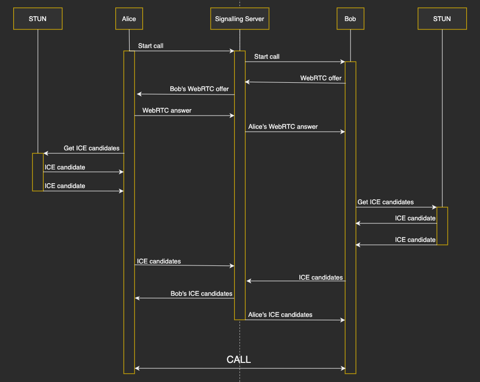

# WebRTC

## Introducción

WebRTC es un proyecto open soruce que permite establecer comunicación peer-to-peer entre navegadores. Aunque teóricamente se puede intercambiar todo tipo de medios, los usos se han focalizado en el intercambio de video y audio para realizar comunicación en tiempo real.
Al habilitar esta comunicación directa entre clientes, se evita tener que pasar por un servidor y estar continuamente enviando y recibiendo mensajes a través del mismo. En WebRTC, aunque realmente la conexión entre clientes se puede llevar a cabo sin necesidad de un elemento externo, generalmente necesitaremos de un servidor para realizar el establecimiento de la conexión y el control de las conexiones (esto se conoce como signaling), de ahí que se hable de un servidor de señalización.

## Proceso de señalización

En WebRTC este proceso de señalización no está establecido y podemos utilizar el que nos convenga en cada aplicación. Por ejemplo, se pueden utilizar WebSockets, SIP, XHR...
El proceso de comunicación es el siguiente:

- Un cliente al entrar en una sala inicia la llamada.
- El iniciador de la llamada crea una _offer_ utilizando SDP (Session Description Protocol) y lo manda al otro cliente.
- El receptor de la llamada responde a la oferta con una respuesta conteniendo su descripción SDP.
- Cada cliente, con este intercambio, ya es consciente de las _settings_ de la llamada, pero todavía no pueden conectarse entre sí ya que hay multitud de intermediarios entre los clientes. Estos intermediarios son las NATs, las restricciones de puertos... con lo que es necesario alguna estrategia por encima para lograr establecer la conexión. Esto se consigue utilizando ICE (Interactive Connectivity Establishment).

### ¿Cómo funciona ICE?

- Primero trata de establecer la conexión utilizando UDP.
- Si no lo consigue, lo vuelve a intentar utilizando TCP.
- Si tampoco se ha conseguido establecer la conexión, se vuelve a intentar utilizando un servidor STUN. Este sería el caso habitual en un escenario real y ocurre porque, generalmente, porque entre los clientes se encuentran firewalls y NAT´s que bloquean la conexión directa. Estos servidores STUN utilizan el protocolo STUN, cuya función es conseguir determinar la dirección pública y el puerto de los clientes.
- Incluso con los servidores STUN, existen escenarios donde aún no se puede establecer la conexión, entonces se puede emplear servidores TURN, que implementan mejores características que les permiten atravesar ciertas restricciones en las NAT´s para conseguir recuperar la dirección pública y el puerto de cada cliente.



## Tras el establecimiento de la conexión

Cuando los clientes consiguen establecer la conexión ya pueden empezar el intercambio de datos. Lógicamente este intercambio se lleva a cabo de forma segura:

- Los streams de medios (video y audio) se encriptan utilizando SRTP (Real Time Transport Protocol), mientras que los streams de datos se encriptan utilizando DTLS (Datagram Transport Layer Security).
- Se pide permiso al cliente para utilizar la cámara y el micrófono.
- WebRTC exige TLS, lógicamente con un certificado, en el proceso de señalización.
- Todos los componentes de WebRTC funcionan en el sandbox de los navegadores que usan encriptación por defecto.

## El problema de las conexiones peer-to-peer

Al establecer una comunicación uno a uno entre cada cliente,se esta formado una red de malla completa entre todos (una red _mesh_), donde cada participante de la conversación envía, de forma separada, un stream a cada uno de los participantes de la conversación. Podemos imaginar que cuando el número de participantes crece, el rendimiento en los clientes decrece y es necesario un equipo potente que pueda llevar a cabo esta tarea. Por lo tanto, para aplicaciones que requieran llamadas con un número elevado de participantes es recomendable utilizar un servidor que reciba cada stream y los distribuya a todos los clientes.

#### Mesh


Esta implementación es la que hemos realizado en nuestro ejemplo.

- Ventajas
  - La implementación es sencilla.
  - Como cada participante se conecta directamente al resto, no se requiere un servidor. Generalmente, sólo se usa un servidor para señalizar y establecer las conexiones.
- Inconvenientes:
  - Para que la conversación sea fluida se ha de establecer un límite en el número de usuarios de una sala (4 ó 5 a lo sumo).
  - Lógicamente se están estableciendo N-1 downlinks y N-1 uplinks en cada cliente.

#### MCU y mixing topology

En este caso, cada participante envia su información a un servidor central y recibe la información del resto de participante desde dicho servidor. La información recibida contiene la información del resto de clientes mezclada. El servidor central se llama MCU.


- Ventajas:
  - La implementación de cada cliente también es sencilla.
  - Cada cliente sólamente recibe un stream. Por lo tanto maneja 1 uplink y 1 downlink.
- Inconvenientes.
  - El servidor tiene que realizar un proceso de recodificación para reunificar el tráfico.

#### SFU y topología de routing

Cada participante envía su stream a un servidor central y recibe el resto desde ese servidor. Al servidor se le llama SFU.


- Ventajas:
  - SFU requiere menos poder de procesamiento que MCU.
  - Cada participante sólo utiliza un uplink.
- Desventajas:
  - El SFU es complejo.
  - N-1 downlinks en cada cliente.

### Ejemplos comerciales.

Estos servidores son complejos de implementar y caros de mantener (conexiones mcu y sfu). Por ello, surgen empresas que venden estos servicios y,además, ofertan sobre ellos otros servicios de valor añadido. Por ejemplo, podemos citar [Bistri](https://bistri.com/).

# Detalles de la implementación.

En nuestra implementación hemos utilizado [Next.js](www.nextjs.org), como base para el desarrollo. Es un framework basado en [React.js](www.reactjs.org) y que permite, entre otras cosas SSR (Server side rendering). Con ello, hemos implementado nuestro propio servidor Node.js donde, utilizando sockets, podemos llevar a cabo el proceso de señalización necesario para establecer la conexión entre los clientes que se conectan a una sala. El proceso que se lleva a cabo es el siguiente:

- Cuando un usuario entra a una sala, crea un socket (se utiliza [socketIO](https://socket.io/)) y emite un evento en ese socket de entrada a sala (_join_room_).
- Este evento llega a servidor (fichero /server/index.js) y se revisa de todos los sockets conectados, cuáles están en esa sala. Si no hay otros clientes (sockets) en esa sala se "crea la sala", se une al cliente a la sala y se le envía al cliente que envió el evento de _join_room_ un evento de _room_created_. Si ya hubiera alguien en la sala, se une al cliente a esa sala y se le envía a ese cliente un evento _room_joined_. Si por el contrario, el número de usuarios de la sala es el máximo, se le envía al cliente el evento _full_room_.
- El cliente recibe el evento enviado por el servidor:
  - Para _room_created_: Es un caso sencillo ya que no hay otros peers con los que tengamos que establecer la comunicación. Por ello, marcamos a este usuario como creador de la sala y, simplemente, se configura su stream de video y se posiciona en pantalla.
  - Para _room_joined_: En este caso, se establece el stream de video en pantalla y se vuelve a enviar un evento a servidor, de nombre _start_call_, con el fin de conectar a este cliente a la llamada.
  - Para _full_room_: Se le informa al cliente que la sala está llena y no se hace ninguna operación con webRTC.
- Continuamos por el caso de establecimiento de una llamada. El servidor recibe el evento _start_call_ del cliente que se conectó a la sala y lo reenvía a todos los clientes que se están conectados a la misma sala.
- Cada cliente recibe el evento _start_call_ y configura su objeto **RTCPeerConnection**. En ese objeto se configuran los servidores STUN y TURN que pueden llegar a necesitarse para establecer la conexión y se incorpora la información necesaria del stream local que se quiere compartir con el nuevo peer. Se emite el evento _webrtc_offer_ hacía servidor.
- El servidor reenvía ese evento al cliente que se quiere conectar, donde crea el **RTCPeerConnection** si no lo había creado e introduce los descriptores de los streams remotos que le vayan llegando. Una vez realizado vuelve a enviar un evento de _webrtc_answer_ hacia servidor, que ya lo reenvía a los clientes para que empiece la comunicación.

# Custom server with TypeScript + Nodemon example

The example shows how you can use [TypeScript](https://typescriptlang.com) on both the server and the client while using [Nodemon](https://nodemon.io/) to live reload the server code without affecting the Next.js universal code.

Server entry point is `server/index.ts` in development and `dist/index.js` in production.
The second directory should be added to `.gitignore`.

## How to use

Execute [`create-next-app`](https://github.com/vercel/next.js/tree/canary/packages/create-next-app) with [npm](https://docs.npmjs.com/cli/init) or [Yarn](https://yarnpkg.com/lang/en/docs/cli/create/) to bootstrap the example:

```bash
npx create-next-app --example custom-server-typescript custom-server-typescript-app
# or
yarn create next-app --example custom-server-typescript custom-server-typescript-app
```
